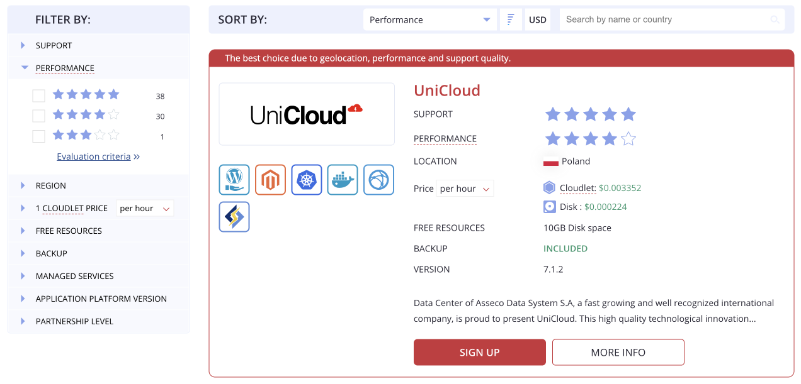
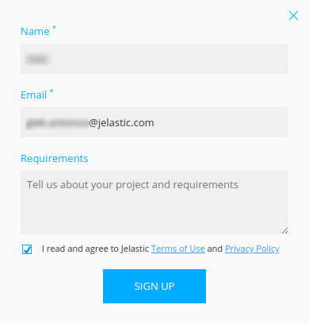
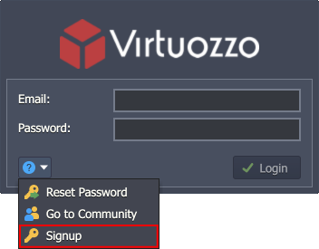
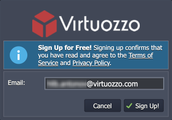
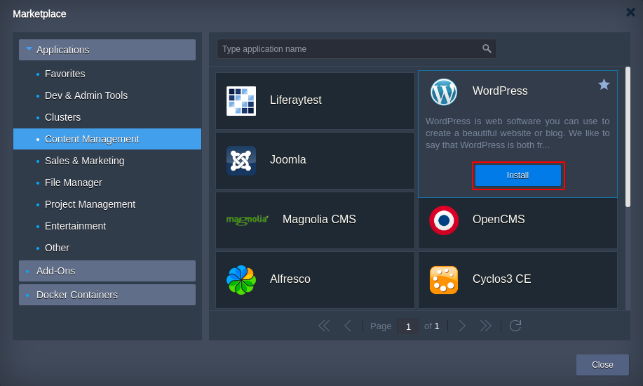
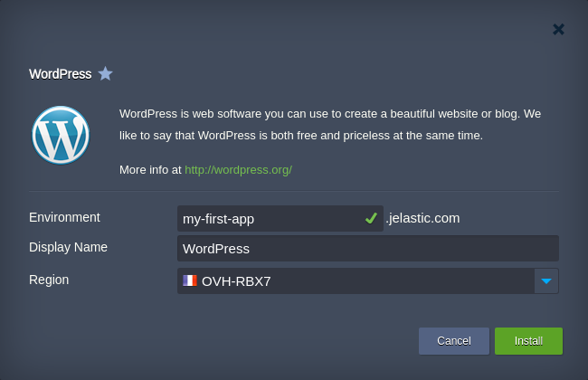
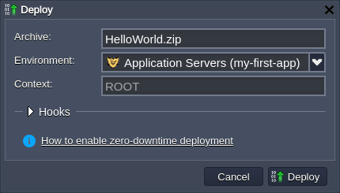
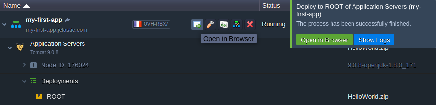

## Getting Started

With the platform intuitive UI, you can quickly deploy your applications to the cloud platform without a necessity to perform any complex configurations.

This guide shows some of the basic steps required to get started with the platform:

- [sign up](/docs/QuickStart/Getting%20Started#sign-up-how-to-create-an-account)
- [deploy application](/docs/QuickStart/Getting%20Started#deploy-application)

## Sign Up: How to Create an Account

In order to start working with the platform, you need the appropriate account. So, if you don’t have one yet, register a new one via:

- [dedicated Cloud Union website](/docs/QuickStart/Getting%20Started#cloud-union)
- [particular platform dashboard](/docs/QuickStart/Getting%20Started#platform-dashboard)

After sign up, you will receive a confirmation email, so just follow the provided instructions (additional verification via captcha or SMS may be required).

:::tip Tip

The account activation link within the email is valid for 24 hours (may vary based on the particular hosting provider settings). If expired, please register anew.

:::

## Cloud Union

Go to the [Cloud Union](https://cloudmydc.com/paas) page, which allows to compare and choose the most suitable hosting service provider.

1. Here, you can find many filters on the left-hand menu and sorting criteria at the top to compare hosting service providers. Use **More Info** button to get even more details about the specific provider.

Once, you’ve found the suitable variant click the **Sign Up** button to register a new account.

2. Fill in the appeared form by providing your Name, Email and, optionally, some of your project Requirements.

Agree to the platform terms of use and privacy policy and click **Sign Up** button to proceed.

That’s it, check your inbox for the confirmation email.

## Platform Dashboard

Access particular platform via [hoster domain](/docs/QuickStart/Hosters%20List%20&%20Info#paas-hosting-providers).

1. Expand the menu at the bottom-left corner and select the Signup](https://cloudmydc.com/) option.

2. Provide your Email in the appeared form.

Click the **Sign Up!** button to agree to the terms of use and privacy policy of the provider.

That’s it, the platform will automatically send the confirmation email to you.

## Deploy Application

When you access the platform dashboard for the first time, a short tutorial (can be manually called via the **Help > Tutorial** option) will be automatically started. It provides you with a quick platform overview and a step-by-step walkthrough for your first environment creation and application deployment. Follow these tips or skip the tutorial and use the steps described below:

- [automatic deployment from application Marketplace](/docs/QuickStart/Getting%20Started#application-marketplace)
- [manual deployment via dashboard](/docs/QuickStart/Getting%20Started#platform-dashboard)

## Application Marketplace

You can access [platform Marketplace](/docs/Deployment%20Tools/Cloud%20Scripting%20&%20JPS/Marketplace#marketplace) directly from the dashboard to install various popular solutions in one click.

1. Click the **Marketplace** button at the top of the dashboard.

2. Find the required solution within the categorised list to the left or using the search field at the top.

Hover over the application plank and click the **Install** button.

3. Configure installation preferences (e.g. environment name, [alias](/docs/EnvironmentManagement/Environment%20Aliases), [region](/docs/EnvironmentManagement/Environment%20Regions/Choosing%20a%20Region), etc.) and click **Install** one more time.

All the further steps will be performed automatically by the platform, i.e. an environment with the required topology creation, the appropriate application deployment, the required dependencies installation, connections (e.g. with a database) and configs setting.

So, in just a few minutes, you’ll get ready-to-work application.

Manual Deployment
In case you want to deploy any custom application and manually control the deployment process on each particular stage, follow the next steps:

1. Click the **New Environment** button in the upper-left corner of the dashboard.

2. The **Topology Wizard** will be opened, where you can [set up your environment](/docs/EnvironmentManagement/Setting%20Up%20Environment). Among the central platform features configurable via this form, there are:

- multiple programming languages support (Java, PHP, Ruby, Python, Node.js, .NET, Go) and custom Docker containers integration
- wide list of managed [software stacks](/docs/QuickStart/Software%20Stack%20Versions).
- [automatic vertical scaling](/docs/ApplicationSetting/Scaling%20And%20Clustering/Automatic%20Vertical%20Scaling) to ensure fair pricing and [horizontal scaling](/docs/ApplicationSetting/Scaling%20And%20Clustering/Automatic%20Horizontal%20Scaling) to provide flexibility and reliability
- [public IP](/docs/ApplicationSetting/External%20Access%20To%20Applications/Public%20IP) attachment for direct access from the Internet

For now, let’s **Create** just a single Tomcat application server.

3. In a minute, your environment will appear on the dashboard.

4. The platform supports multiple ways of automatic [application deployment](/docs/Deployment/Deployment%20Guide) so that you can select the most suitable option. For this example, we’ll show the deployment of a default Hello World application from the archive in the deployment manager (located at the bottom of the dashboard).

:::tip Tip

You can easily add your applications to the [Deployment Manager](/docs/Deployment/Deployment%20Manager) by uploading archive (either from local machine or via URL) or adding the appropriate Git/SVN repository.

:::

Hover over the project and click the **Deploy to** button.

5. Within the opened **Deploy** frame, just select your Environment and proceed with the **Deploy** button.

6. Wait for the successful deployment pop-up and click **Open in Browser** to ensure everything works fine.

6. Herewith, if your application requires some additional settings or don’t have a web interface, do not hesitate to use various in-build [configuration tools](/docs/Container/Container%20Configuration/Configuration%20Tools).

That’s all! Enjoy using the platform!
