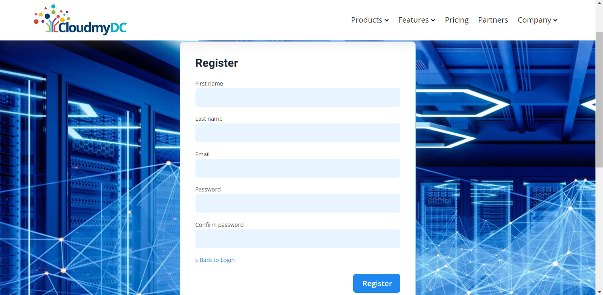

Simplify application deployment with our platform’s easy-to-use interface minimizing the need for intricate configurations.

## Sign Up: How to create an Account

To start using the platform, you need the right access credentials. If you don’t have an account, register one through the [specific platform dashboard](https://cloudmydc.com/).

Once you click on the profile icon, you will be presented with the option to sign up, and the following page will be presented to you for your account registration.

After signing up, you will receive a confirmation email with further instructions. Some additional verification, such as CAPTCHA might be necessary.

:::tip Note

The activation link in your email will be valid for 24 hours. If the link expires, please register again.

:::

After email confirmation:

1. Once you have confirmed your email, log in to the CloudMyDc platform.

2. You will see two main sections:
   - **_Infrastructure_** – _Infrastructure as a Service_ provides on demand virtual machines, networking and storage resources enabling dynamic scaling and management of cloud platform.
   - **_Platform_** - Effortlessly create and deploy application-specific environments saving time and resources.

## Infrastructure Platform

- Select Virtual Infrastructure under the tab to proceed.
- After selecting “Virtual Infrastructure”, a pop-up will appear suggesting you to “**Create a project**”.
- Click on the **Create a project** button.
- Provide a name for your project and confirm the creation.

## Platform Dashboard

- To work with the application platform, select the **_platform_** tab.
- From there you will see an option for the **_application Platform_**.
- Click on “Go to Dashboard”, to proceed to the next page.

- Once in the Dashboard, you will see a “Welcome” message confirming your interest in the product.
- This message also lets you know that you are just one step away from creating your account to gain full access.
- Click continue to complete this step and proceed with the set up.

- You will get a pop up to upgrade to a paid account.
- Fill in your billing details.
- Add company name, if applicable.
- Ensure you have read and agree to the Terms of service.

Once you have filled in all the required information correctly and agreed to the terms, click the “upgrade” button to proceed to the next step.

After completing the first step, you should be prompted to select a payment method and enter your payment information.

1. Select payment method:
   - Choose the “stripe” option and follow the on-screen instructions to add a new payment method.
   - If you prefer a different payment method, you can contact the service provider to discuss available options.
2. Deposit Funds:
   - Use the slider to determine the amount you want to deposit. The current example shows a deposit of $10.
   - The “_Total Payable_” amount will reflect the selected deposit.
3. Auto-Refill (optional)

If you want the account to be automatically refilled when the balance reaches $0, check the “_auto refill the account when the balance reaches $0_” box.

Once you've selected your payment method, deposit amount, and auto-refill option, click the "_Submit_" button to complete the upgrade process.

:::tip Note

Be aware that your hourly resource usage will be deducted from your prepaid account balance.
If you have any questions or encounter issues, contact the service provider for assistance.

:::

4. Review payment details:

- Verify that the amount to be charged is correct. The current example shows ($10.00 + $0.00 VAT).
- Ensure that the selected payment method is accurate.
- If you're using a card, double-check that the card details are entered correctly.

- If you're satisfied with the payment details, click the "Yes" button to proceed with the payment.
- If you need to make any changes, click the "No" button to go back and edit your payment information.
- Once you confirm the payment, the transaction will be processed. If successful, you should receive a confirmation message or email.
- A Small tutorial will be displayed on the screen, explaining the key components of a cloud platform.
  - Exploring the features of a cloud application platform.
  - Process of building an application topology using a visual interface.

After the Demo You will be presented with the home page:

- Create New Environment
- Deploy Solution from Marketplace
- Collaborate on Shared Environment

## Create a new environment

The Topology Wizard will be opened, where you can set up your environment. Among the central platform features configurable via this form, there are:

- Multiple programming languages support (Java, PHP, Ruby, Python, Node.js, .NET, Go) and custom Docker containers integration
- Wide list of managed software stacks.
- Automatic vertical scaling to ensure fair pricing and horizontal scaling to provide flexibility and reliability.
- Public IP attachment for direct access from the internet.

## Deploy solution from marketplace:

1. Look through the available applications and add-ons to find solutions that align with your needs.

2. Choose an application or add-on that you want to deploy.

3. Configure any necessary settings for the selected solution.

4. Deploy the solution to your existing or newly created environment.

5. Track the deployment process and manage the deployed solution as needed.

## Collaborate on shared environment:

- If working with a team, invite them to collaborate on the shared environment.
- Invite team members: Click on “Invite” button to invite other users to the shared environment.
- Assign appropriate roles and permissions to the invited team members.
- Ensure that everyone has the necessary access and permissions.

**_You are now ready to start and create!_**
