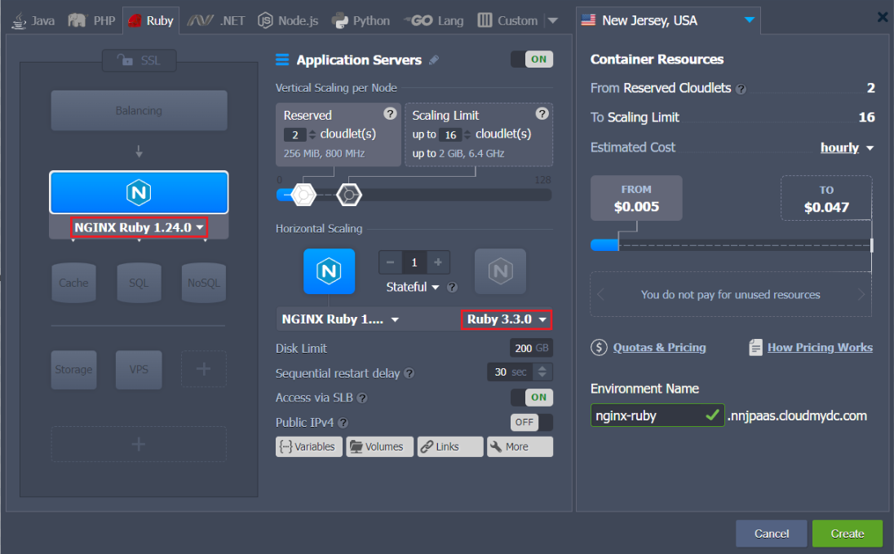
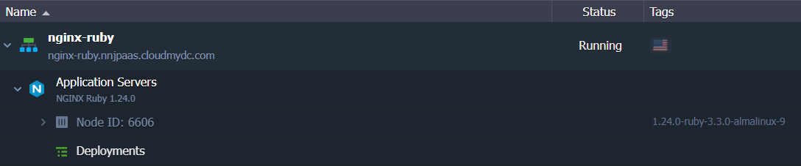

## NGINX Ruby

:::tip

The _NGINX Ruby_ stack is [HTTP/3](/docs/ApplicationSetting/External%20Access%20To%20Applications/HTTP3%20Support#http3-quic-support) ready with the feature support enabled by default since the _1.16.1_ release for Ruby _2.4.9, 2.5.7, 2.6.5, 2.7.0_ versions and above. However, a [public IP address](/docs/ApplicationSetting/External%20Access%20To%20Applications/Public%20IP#public-ip) is required to bypass the Shared Load Balancer and work directly with the server over HTTP/3.

:::

**NGINX Ruby** software stack is a combination of the highly popular, open-source _NGINX_ web server with the pre-installed _Ruby_ programming language. This combination utilizes the _Passenger_ application server by default, but the stack can be easily reconfigured to change the [ruby application server](/docs/Ruby/Ruby%20App%20Server%20Configuration#ruby-application-server-configuration) (to either _Puma_ or _Unicorn_).

NGINX Ruby is suitable for any Ruby application due to its scalability, security, reliability, and cost-efficiency. Creating this stack at the platform can be done in just a few clicks in a matter of minutes.

:::tip Note

This template utilizes a modern **_systemd_** initialization daemon.

:::

1. Click the **New Environment** button at the top-left corner of the dashboard.

2. Switch to the Ruby tab of the automatically opened topology wizard and choose **NGINX Ruby** as your application server. If needed, add any other stacks required for your environment.

Next, you can configure the [Ruby engine version](/docs/Ruby/Ruby%20Versions#ruby-versions) and other parameters of the added stacks using the central part of the wizard (e.g. set [scaling limit](/docs/ApplicationSetting/Scaling%20And%20Clustering/Automatic%20Vertical%20Scaling#automatic-vertical-scaling), [nodes count](/docs/ApplicationSetting/Scaling%20And%20Clustering/Horizontal%20Scaling#horizontal-scaling-inside-the-cloud-multi-node), attach [public IPs](/docs/ApplicationSetting/External%20Access%20To%20Applications/Public%20IP#public-ip), etc.). When ready, provide the desired environment name and click **Create**.

3. In a minute, your environment will appear on the dashboard.

Now, you can proceed to the deployment of your application to the NGINX Ruby serber.
