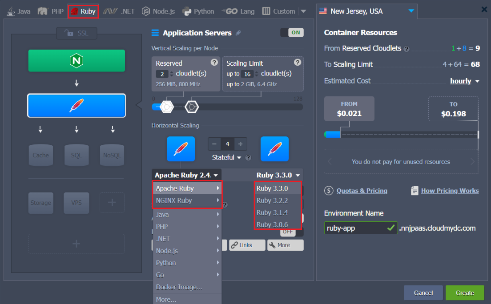
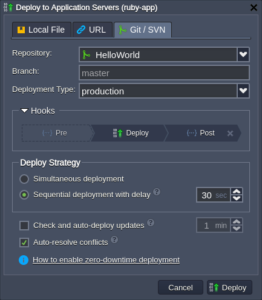
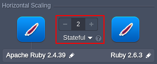
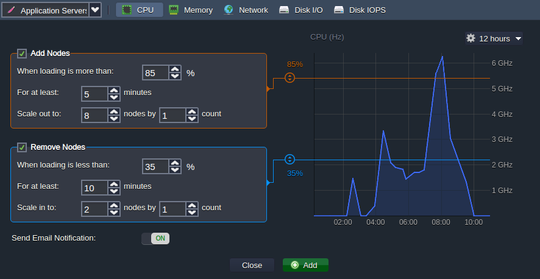

## Ruby PaaS Hosting

**Ruby** is a popular, open source programming language with a powerful and practical, yet natural and easy to read/write syntax. Ruby combines the best practices from various solutions to provide a unique object-oriented language, which aims for simplicity and provides such features as basic & special object-oriented features; operator overloading; exception handling; iterators and closures; garbage collection, and more.

The platform provides an out-of-box integration of the Ruby web servers, providing all the management and automatization tools (e.g. _Ruby on Rails_ web-development framework) for comfortable hosting and maximally convenient Ruby application development.

In this article, we’ll go through the distinctive features of the [Ruby](https://www.ruby-lang.org/en/) hosting and introduce the Ruby-related possibilities within the platform. Use the table of content below to find required information within the guide quicker:

- [Ruby Environment Hosting](/docs/Ruby/Ruby%20Dev%20Center#ruby-environment-hosting)
  - [Ruby Application Servers](/docs/Ruby/Ruby%20Dev%20Center#ruby-application-servers)
  - [Ruby Versioning](/docs/Ruby/Ruby%20Dev%20Center#ruby-versioning)
- [Ruby Application Deployment](/docs/Ruby/Ruby%20Dev%20Center#ruby-application-deployment)
- [Ruby Dependency Management](/docs/Ruby/Ruby%20Dev%20Center#ruby-dependency-management)
- [Ruby Post Deploy Configuration](/docs/Ruby/Ruby%20Dev%20Center#ruby-post-deploy-configuration)
- [Domains Management](/docs/Ruby/Ruby%20Dev%20Center#domains-management)
- [Automatic Vertical Scaling](/docs/Ruby/Ruby%20Dev%20Center#automatic-vertical-scaling)
- [Manual Horizontal Scaling](/docs/Ruby/Ruby%20Dev%20Center#manual-horizontal-scaling)
- [Automatic Horizontal Scaling](/docs/Ruby/Ruby%20Dev%20Center#automatic-horizontal-scaling)

## Ruby Environment Hosting

The platform provides a powerful and intuitive topology wizard to [set up](/docs/environment-management/setting-up-environment) the hosting of a new environment.

Switch to the _Ruby_ language tab, select the required application server and engine version, add any other [software stack](/docs/quickstart/software-stack-versions) required. If needed, adjust other parameters, such as cloudlets (RAM and CPU), disk space, public IPv4/IPv6, node count, etc.

:::tip Note

Both _Apache Ruby_ and _NGINX Ruby_ templates utilize a modern **_systemd_** initialization daemon.

:::

:::tip Note

All instances are [completely isolated](/docs/PlatformOverview/Isolated%20Container) and fully independent containers. Additionally, scaled out nodes are automatically distributed across the physical servers (or VMs), ensuring [high availability](/docs/PlatformOverview/Isolated%20Container#high-availability-for-applications).

:::

## Ruby Application Servers

The platform provides [Ruby application servers](/docs/Ruby/Ruby%20App%20Server%20Configuration#ruby-application-server-configuration) based on the _Apache_ and _NGINX_ software stacks. Both ones are configured to utilize the _Ruby on Rails_ framework for implementing web applications and the **Passenger** application server by default.

If needed, the _NGINX Ruby_ stack can be easily configured to work with different inbuilt servers:

- [**_Passenger_**](https://www.phusionpassenger.com/) - one of the most feature-rich application servers for Ruby, which are invaluable for the modern web apps and microservice APIs
- [**_Puma_**](https://puma.io/) - a Ruby web server oriented on speed and parallelism due to fast and accurate HTTP 1.1 protocol parsing
- [**_Unicorn_**](https://yhbt.net/unicorn/) - an HTTP server, which takes advantage of the Unix/Unix-like kernels features for serving fast clients on low-latency, high-bandwidth connections

## Ruby Versioning

The following Ruby versions are supported at the time of this writing:

- 3.0.6
- 3.1.4
- 3.2.2

:::tip

The up-to-date list of the releases available on the platform is provided via the dedicated, regularly (weekly) updated [Software Stack Versions](/docs/quickstart/software-stack-versions) document.

:::

You can select the required [version of Ruby](/docs/Ruby/Ruby%20Versions#ruby-versions) via the topology wizard during the creation of a new environment, as well as adjust it for the existing instances via [container redeployment](/docs/category/container-deployment).

## Ruby Application Deployment

The platform automates the deployment process for the managed _Apache Ruby_ and _NGINX Ruby_ application servers using:

- application **_archive_** uploaded from the local machine or via external URL
- remote **_VCS_** repository (e.g. GitHub)

When deploying a Ruby application, only a single context (ROOT) can be used. However, you can select from three _Deployment Types_ (i.e. [RAILS_ENV](https://guides.rubyonrails.org/configuring.html#rails-environment-settings)) for it:

- **_development_** - reloads all application classes and turns off caching (allows a faster development cycle)
- **_production_** - turns on all caching
- **_test_** - wipes out database between test runs

If needed, you can switch between the Ruby deployment types via the appropriate drop-down list next to your application (see the image below).

Read the related documents to learn more about the deployment of the Ruby applications:

- [Deployment Manager](/docs/deployment/deployment-manager)
- [Deployment Guide](/docs/deployment/deployment-guide)
- [Auto-Deploy Overview](/docs/Deployment/Git%20&%20SVN%20Auto-Deploy/Auto-Deploy%20Overview#auto-deploy-of-gitsvn-updates)
- [Deployment Hooks](/docs/Deployment/Deployment%20Hooks)

## Ruby Dependency Management

All Ruby instances within the platform are provided with the [**_Bundler_**](https://bundler.io/) dependency manager for automatic tracking and installing the exact gems and versions, which your project requires. If the project has a _Gemfile_ file in the root folder, it will automatically resolve dependencies with Bundler after deployment to the server without you having to perform any manual intervention.

Also, if needed, you can include any Ruby framework into your Gemfile (_Sinatra, Rack, therubyracer, Ramaze_, etc.) or utilize [**_Ruby on Rails_**](https://rubyonrails.org/) - one of the most popular frameworks for developing and implementing web applications, which is available by default.

Refer to the [Ruby Dependency Management](/docs/Ruby/Ruby%20Apps%20Specifications/Dependency%20Management#ruby-dependency-management) documentation for additional information.

## Ruby Post Deploy Configuration

In order to automate the repetitive actions that Ruby projects need to perform after the application is deployed (e.g. _db:migrate_), a **_rake_deploy_** file (located in the root folder of the project) can be created.

The file should contain a list of commands (each one from a new line) that will be executed consecutively via the [**_rake_**](https://ruby.github.io/rake/) tool after each restart of the Apache/NGINX node. After successful execution, the **_rake_deploy_** file is automatically removed. Refer to the [Ruby Post Deploy Configuration](/docs/Ruby/Ruby%20Apps%20Specifications/Post%20Deploy%20Configuration#ruby-post-deploy-configuration) documentation for additional information.

## Domains Management

You can provide a [custom domain](/docs/ApplicationSetting/Domain%20Name%20Management/Custom%20Domain%20Name#custom-domain-name) name for your Ruby application to be used instead of the default one. Based on the environment topology, you should use:

- **CNAME redirect** if using _Shared Load Balancer_; is recommended for **_dev_** and **_test_** environments
- **DNS A Record** if using _public IP_; can handle high traffic load and is suitable for **_production_** environments

To switch traffic from one environment to another (e.g. to redirect customers to the newer application version without downtime), the [swap domains](/docs/ApplicationSetting/Domain%20Name%20Management/Swap%20Domains#swap-domains) functionality should be used. It is also available as the **_SwapExtIps_** [API](https://docs.jelastic.com/api/#!/api/environment.Binder-method-SwapExtIps)/[CLI](/docs/Deployment%20Tools/API%20&%20CLI/Platform%20CLI/Swap%20Public%20IPs#cli-tutorial-public-ips-external-addresses-swap) method.

## Automatic Vertical Scaling

One of the key-features of the platform is dynamic provisioning of the exact amount of resources (RAM and CPU) required by your nodes according to the current load with no manual intervention. Just set the required [cloudlets](/docs/PlatformOverview/Cloudlet#what-is-a-cloudlet) limit (_128 MiB_ of RAM and _400 MHz_ of CPU each) for your Ruby application server and everything else will be handled by the platform automatically.

As a result, you automatically benefit on a truly user-oriented [**_Pay-per-Use_**](/docs/Account&Pricing/Pricing%20Model%20Overview#platform-usage-based-pricing-pay-per-use) charging approach and don’t need to guess or predict the incoming load. It ensures that you never overpay for unused resources and save your time because the platform eliminates the need to handle the load-related adjustments or perform architectural changes manually.

Refer to the [automatic vertical scaling](/docs/ApplicationSetting/Scaling%20And%20Clustering/Automatic%20Vertical%20Scaling#automatic-vertical-scaling) documentation for additional information.

## Manual Horizontal Scaling

[Horizontal scaling](/docs/ApplicationSetting/Scaling%20And%20Clustering/Horizontal%20Scaling#horizontal-scaling-inside-the-cloud-multi-node) with the platform is as simple as selecting the required number of nodes via the corresponding section in the topology wizard. Additionally, you can choose between two scaling modes:

- **_Stateless_** - simultaneously creates all new nodes from the base image template
- **_Stateful_** - sequentially copies file system of the master container into the new nodes

:::tip Note

For the proper distribution of requests, a [load balancer](/docs/Load%20Balancers/Load%20Balancing#load-balancing) instance is automatically added upon Ruby server scaling.

:::

The maximum number of the same-type servers within a single environment layer depends on a particular hosting provider settings (usually this limit stands for 16 nodes and can be enlarged by sending the appropriate request to support).

## Automatic Horizontal Scaling

You can configure [automatic horizontal scaling](/docs/ApplicationSetting/Scaling%20And%20Clustering/Automatic%20Horizontal%20Scaling#automatic-horizontal-scaling) for your Ruby environment through tunable triggers, which monitor the changes in the nodes load and increase/decrease their number appropriately.

The process is simple, access the environment **Settings > Monitoring > Auto Horizontal Scaling** section, choose the required layer and resource to be monitored (_CPU, RAM, Network, Disk I/O, Disk IOPS_). Set the exact condition and specifics of scaling via the intuitive UI form.

In addition, hosting at the PaaS allows using other built-in tools and features, for example:

- [Built-in](/docs/ApplicationSetting/SSL/Built-In%20SSL#built-in-ssl-certificates) or [Custom SSL](/docs/ApplicationSetting/SSL/Custom%20SSL#custom-ssl-certificates)
- [Public IPv4 and IPv6](/docs/ApplicationSetting/External%20Access%20To%20Applications/Public%20IP#public-ip)
- A wide range of complementary [software stacks](/docs/quickstart/software-stack-versions), including SQL and NoSQL databases
- [Container firewalls](/docs/ApplicationSetting/External%20Access%20To%20Applications/Container%20Firewall#container-firewall-rules-management), [endpoints](/docs/ApplicationSetting/External%20Access%20To%20Applications/Endpoints#endpoints-a-direct-connection-to-the-cloud) and [environment network isolation](/docs/EnvironmentManagement/Environment%20Isolation#environment-network-isolation)
- [User-friendly UI](/docs/QuickStart/Dashboard%20Guide) and [SSH access](/docs/Deployment%20Tools/SSH/SSH%20Access/Overview#ssh-access)
- [Open API](/docs/Deployment%20Tools/API%20&%20CLI/API%20Overview#platform-api) and [Cloud Scripting](https://docs.cloudscripting.com/) for automation
- [Pay-per-use pricing model](/docs/Account&Pricing/Pricing%20Model%20Overview#platform-usage-based-pricing-pay-per-use)
- [Collaboration for teamwork](/docs/Account&Pricing/Accounts%20Collaboration/Collaboration%20Overview#account-collaboration)
- [Multi-cloud distribution](/docs/EnvironmentManagement/Environment%20Regions/Choosing%20a%20Region#environment-regions)

Explore Ruby hosting benefits within the platform!
