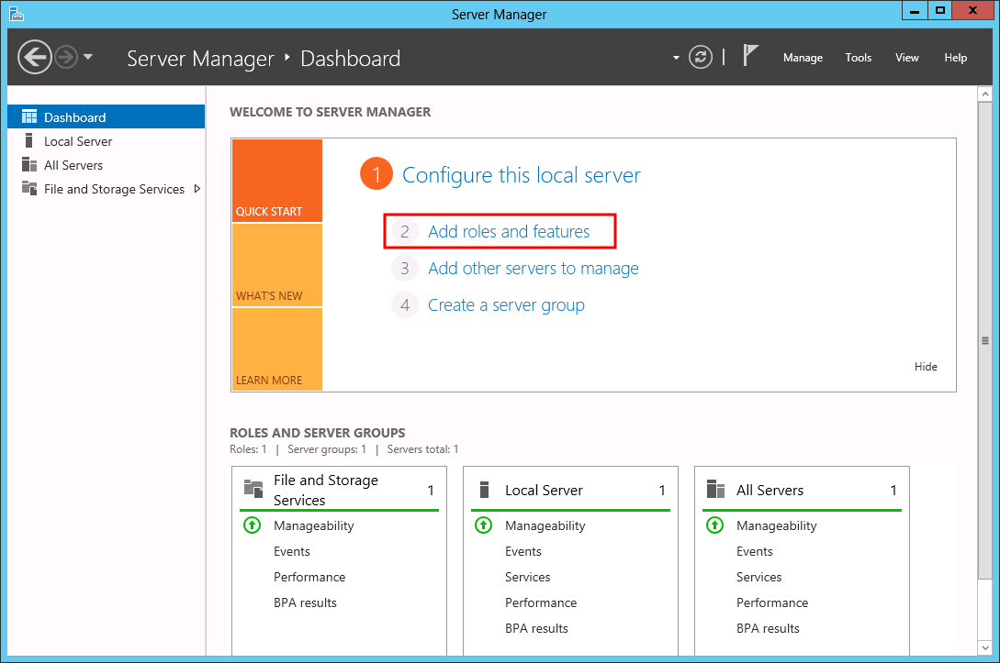
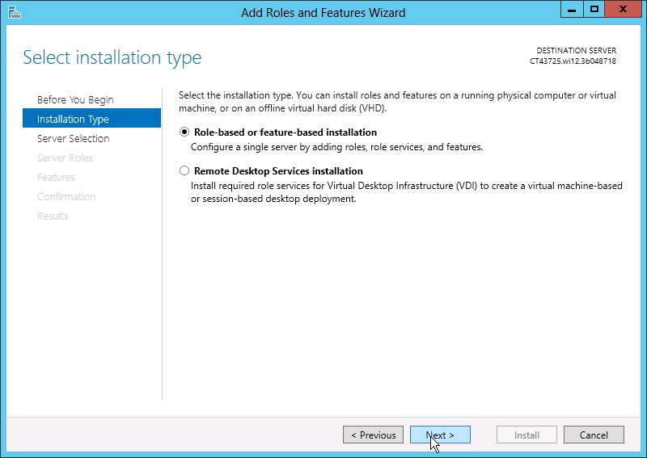
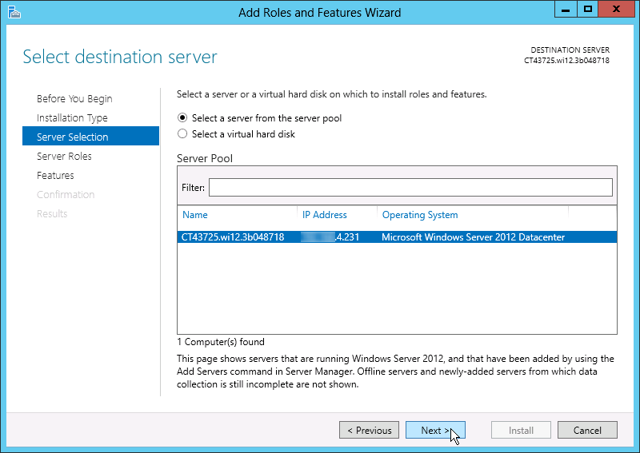
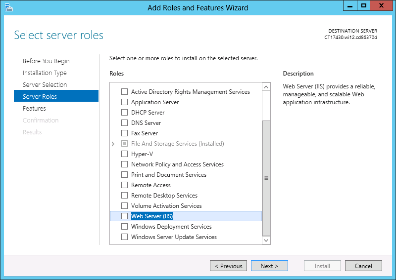
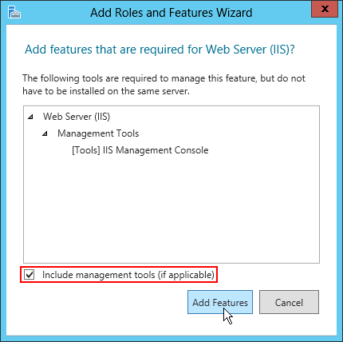
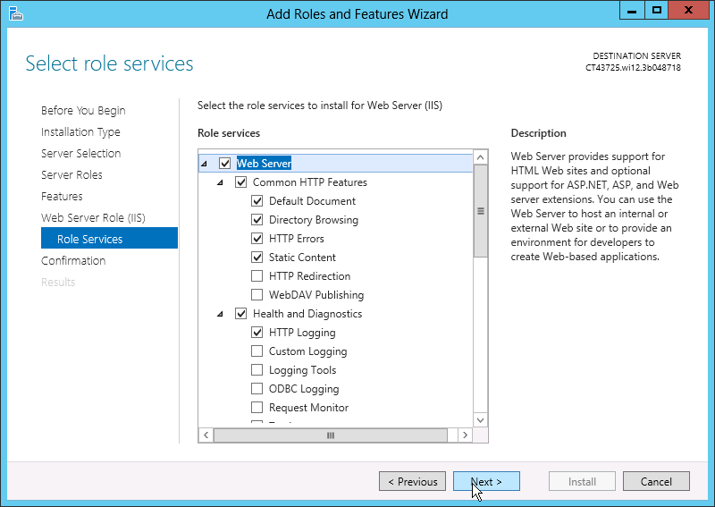
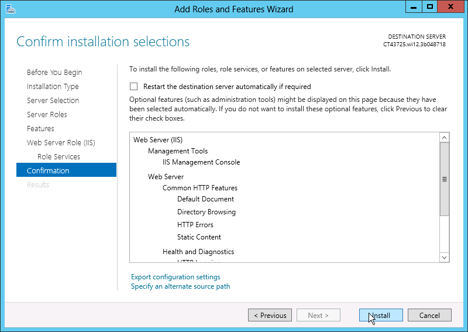
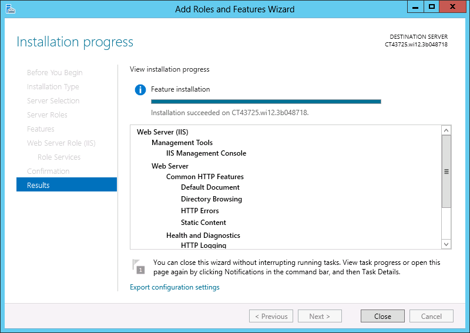
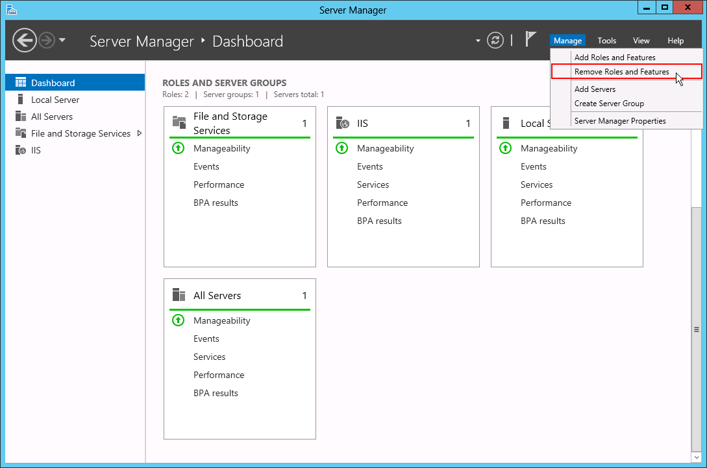

<!-- ## Set Windows Roles and Features via Server Manager -->

[Windows VM](/windows-and-.NET/windows-server-vm) provides a powerful GUI of Windows OS that can be accessed via [remote desktop protocol](/windows-and-.NET/windows-rd-access) (RDP). It allows connect to and manage your Windows instance remotely, for example:

- via the [Guacamole](/windows-and-.NET/windows-rd-access#rdp-connection-via-web-client) HTML5 tool directly in your browser
- via the [local RD client](/windows-and-.NET/windows-rd-access#rdp-connection-via-local-client) (the appropriate credentials for connection establishment can be found in the email, sent after environment creation)

For configuring Windows virtual private server via RDP, the inbuilt Server Manager is used. Below we highlight some of the basic functionalities it provides :

- [setting server roles](/windows-and-.NET/managing-server-roles-&-features#set-windows-vm-roles)
- [adding server features](/windows-and-.NET/managing-server-roles-&-features#add-features-to-windows-server-roles)

## Set Windows VM Roles

Once [connected](/windows-and-.NET/windows-rd-access) to the required node’s desktop, you’ll see the **Server Manager** tool opened. As an example, let’s add a new server role with the following steps.

1. Click the **Add roles and features** link located on the manager’s main page.

2. The corresponding wizard will be opened in a new window with some basic pre-start information displayed, thus check it out and click on **Next**.

At the Installation Type tab, select the **Role-based or feature-based installation** option and proceed with the **Next** button.

3. The Server Selection tab will help you to choose the server you want to configure (several servers of a single Active Directory domain can be added through the Add Servers option on the main **Server Manager** page).

Select the current one and navigate to the **Next** tab.

4. Within the Server Roles tab, click on a particular role from the list of available ones to get its description (at the right part of the window) and tick the required check-boxes to enable corresponding roles.

We’ll add the **Web Server (IIS)** role as an example and proceed with managing its features in the next section.

## Add Features to Windows Server Roles

Depending on the previously selected server role, you can activate some additional server features inherent for it.

1. Upon a role selection, you’ll be displayed a pop up window with the list of non-obligatory role-dedicated management tools (you can enable or disable their installation with the check-box below).

Hit the **Add Features** button.

2. During the next several wizard steps (depending on the chosen roles) you can manage some additional features. For that, read the selected roles' details and specify the required services for them.

Finish your configurations and click **Next**.

3. At the last Confirmation tab, check the configurations you’ve previously specified and click **Install** if everything is OK.

4. The installation will start automatically. You can wait until it is successfully finished or close the current window and continue working, while this process will be finished in the background.

5. Once installation is completed, new role(s) will appear at the Server Manager’s dashboard, where they can be easily accessed for tracking and additional adjustment of parameters.

Also, you can always remove any custom role or feature with the help of the completely similar wizard, available through the **Remove Roles and Features** option in the **Manage** drop-down dashboard list.

:::tip Tip

If you’d like to learn more about the available Windows VM possibilities, refer to the [Windows Server 2008 R2](<https://learn.microsoft.com/en-us/previous-versions/windows/it-pro/windows-server-2008-R2-and-2008/dd349801(v=ws.10)?redirectedfrom=MSDN>) and [Windows Server 2012](<https://learn.microsoft.com/en-us/previous-versions/windows/it-pro/windows-server-2012-R2-and-2012/hh801901(v=ws.11)?redirectedfrom=MSDN>) official documentation.

:::
