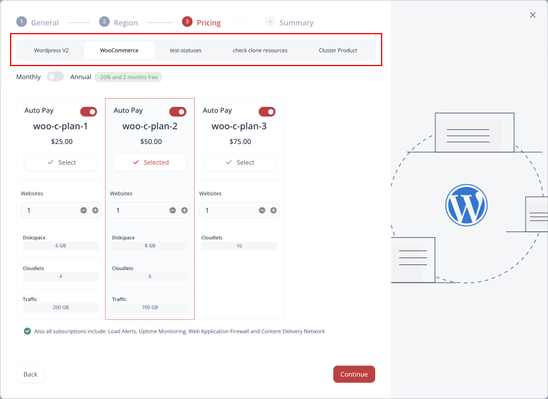

<!-- ## WordPress PaaS -->

CloudMyDC Application Platform for WordPress is a DevOps platform dedicated to WordPress hosting specifically. It offers a number of prepackaged topologies of varying complexity (from single-container solutions to clusters and synchronized multi-region instances), which covers all the range of use cases (from small testing installation to the enterprise-level clusters).

Below, you can find a list of all the standard [WordPress topologies](/wordpress-as-a-service/wordpress-topologies) available on the platform:

- **Standalone** - a single-container solution with NGINX
- **Standalone Pro** - a single-container solution with LiteSpeed
- **WooCommerce** - a single-container solution with NGINX and WooCommerce plugin
- **WooCommerce Pro** - a single-container solution with LiteSpeed and WooCommerce plugin
- **Cluster** - a clustered solution based on LiteSpeed and MariaDB Galera
- **WooCommerce Cluster** - a clustered solution based on LiteSpeed, MariaDB Galera, and WooCommerce plugin​
- **Multi-Region Standalone** - the Standalone Pro package deployed and synchronized between different regions

:::tip Tip

The list of topologies, service plans, and specifics may vary for different platforms.

:::

## Platform Benefits

CloudMyDC Application Platform for WordPress provides numerous features that can significantly enhance your WordPress development and hosting experience:

- **automatic WordPress** instance installation with multiple preconfigured topologies
- **[robust dashboard](/wordpress-as-a-service/wordpress-dashboard/wordpress-dashboard-overview)** with numerous features you may like (built-in file manager, real-time statistics monitoring, etc.)
- automated **[backup and restore](/wordpress-as-a-service/wordpress-backups)** processes
- the **subscription-based** pricing model
- powerful API for automation and scripting
