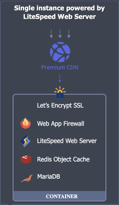
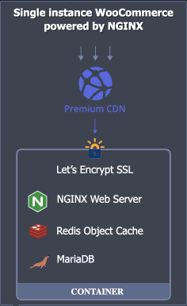
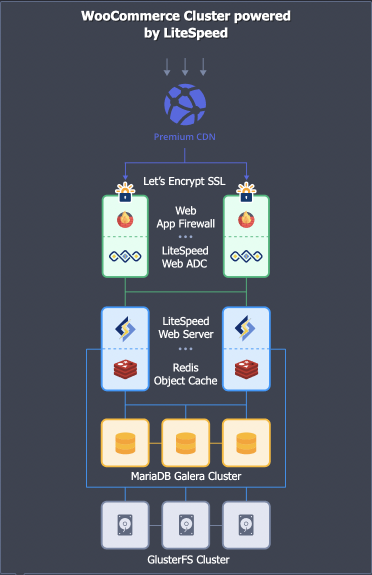

## WordPress Topologies

Each CloudMyDc Application Platform for WordPress can provide a different combination of packages with varying specifics. The list below provides an overview of some standard solutions that may be available on the platform.

:::danger Note

The list of offered WordPress packages and their specifics may vary for each platform.

:::

## WordPress Standalone

The **WordPress Standalone** package has an efficient single node topology based on the CloudMyDc Application Platform certified [LEMP](/docs/PHP/PHP%20App%20Servers/LEMP%20&%20LLSMP) (Linux + NGINX + MariaDB + PHP) template with a set of built-in advanced features. The packaged structure makes this solution optimal for running small- and medium-size projects and development environments that do not require scalability or high availability.

## WordPress Standalone Pro

The **WordPress Standalone Pro** package has an efficient single node topology based on the CloudMyDc Application Platform certified [LLSMP](/docs/PHP/PHP%20App%20Servers/LEMP%20&%20LLSMP) (Linux + LiteSpeed + MariaDB + PHP) template with a set of built-in advanced features. The packaged structure makes this solution optimal for running small- and medium-size projects and development environments that do not require scalability or high availability.

:::tip Tip

Learn about _*LiteSpeed Benefits Over Other Servers for WordPress Hosting*_ in the dedicated blog article.

:::

## WordPress WooCommerce

The **WordPress WooCommerce** package has an efficient single node topology based on the CloudMyDc Application Platform certified [LEMP](/docs/PHP/PHP%20App%20Servers/LEMP%20&%20LLSMP) (Linux + NGINX + MariaDB + PHP) template with the [WooCommerce](https://wordpress.org/plugins/woocommerce/) plugin and a set of built-in advanced features. The packaged structure makes this solution optimal for running small- and medium-size projects and development environments that do not require scalability or high availability.

WooCommerce is a free, open-source e-commerce plugin designed specifically for WordPress. It is a great platform for an online store of any size. WooCommerce has a number of features, such as various payment delivery and receipt methods, custom types of goods, and much more.

## WordPress WooCommerce Pro

The **WordPress WooCommerce Pro** package has an efficient single node topology based on the CloudMyDc Application Platform certified [LLSMP](/docs/PHP/PHP%20App%20Servers/LEMP%20&%20LLSMP) (Linux + LiteSpeed + MariaDB + PHP) template with the [WooCommerce](https://wordpress.org/plugins/woocommerce/) plugin and a set of built-in advanced features. The packaged structure makes this solution optimal for running small- and medium-size projects and development environments that do not require scalability or high availability.

:::tip Tip

Learn about _LiteSpeed Benefits Over Other Servers for WordPress Hosting_ in the dedicated blog article.

:::

WooCommerce is a free, open-source e-commerce plugin designed specifically for WordPress. It is a great platform for an online store of any size. WooCommerce has a number of features, such as various payment delivery and receipt methods, custom types of goods, and much more.

## WordPress Cluster

The **WordPress Cluster** package offers a reliable structure with replication of all the components to provide high availability and fault tolerance. WordPress cluster helps to handle permanent high load and huge load spikes, ensures zero downtime, improves performance, and, as a result, offers an excellent experience even for the most demanding users. The package is aimed at hosting large-size production projects.

The cluster is automatically resized based on the load, ensuring the best performance during the varying load with sudden activity spikes. The platform monitors the load in real-time and scales the number of application servers according to the following rules (without any manual intervention):

- **adds 2 nodes** if the load stays **above 30%** of the total capacity for at least 1 minute (up to 16 nodes at max)
- **removes 1** node if the load stays **below 10%** of the total capacity for at least 5 minutes (no less than 2 nodes)

## WordPress WooCommerce Cluster

The **WordPress WooCommerce Cluster** package offers a reliable structure with replication of all the components to provide high availability and fault tolerance. WordPress cluster helps to handle permanent high load and huge load spikes, ensures zero downtime, improves performance, and, as a result, offers an excellent experience even for the most demanding users. The built-in integration with the WooCommerce plugin provides quick and straightforward provision of a store of any size. The package is aimed at hosting large-size production projects.

The cluster is automatically resized based on the load, ensuring the best performance during the varying load with sudden activity spikes. The platform monitors the load in real-time and scales the number of application servers according to the following rules (without any manual intervention):

- **adds 2 nodes** if the load stays **above 30%** of the total capacity for at least 1 minute (up to 16 nodes at max)
- **removes 1** node if the load stays **below 10%** of the total capacity for at least 5 minutes (no less than 2 nodes)

WooCommerce is a free, open-source e-commerce plugin designed specifically for WordPress. It is a great platform for an online store of any size. WooCommerce has a number of features, such as various payment delivery and receipt methods, custom types of goods, and much more.

## WordPress Multi-Region Standalone

CloudMyDc Application Platform for WordPress provides a multi-region geographic distribution approach for WordPress CMS deployment. The application will be distributed as standalone instances across several [regions](/docs/environment-management/environment-regions/choosing-a-region) within one cloud to ensure automatic fault-tolerance and low latency read operations for the users based on their location.

Such implementation provides a high availability level and ensures business continuity even in case of a data center outage. Additionally, having several WordPress instances in different locations over the globe can significantly improve website ranking from search engine side by decreasing response time and consequently attracting more customers worldwide.

