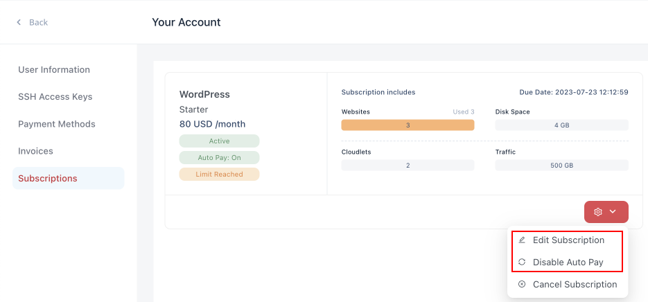
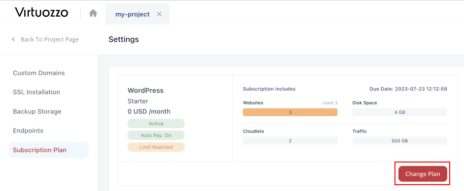
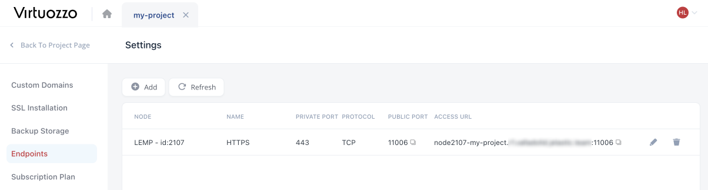
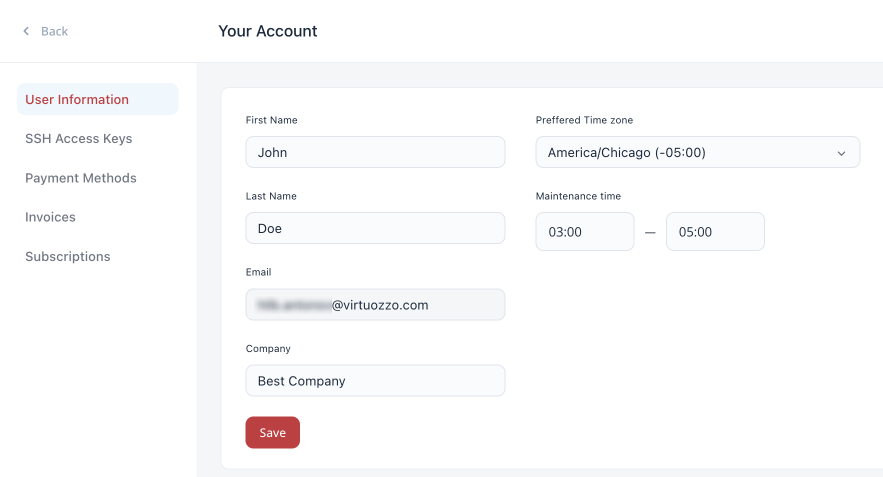
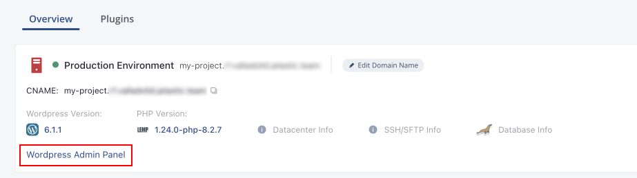
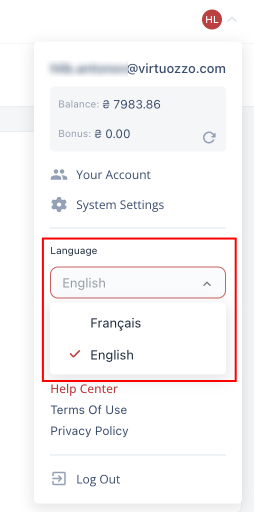

    

New

    

        

            <h3 style={{
                fontSize: '23px',
                fontWeight: '500',
        }}>Subscription Improvements</h3>
            
Implemented new features for subscriptions, including subscription update, migration, and disabling/enabling the <i>Auto Pay</i> option

            

                <a href="/">
                    Learn More >>
                </a>
            

        

        

            <h3 style={{
                fontSize: '23px',
                fontWeight: '500',
        }}>Endpoints Support</h3>
            
Implemented a new Endpoints feature that allows establishing a direct connection to nodes without the mandatory public IP address

            

                <a href="/">
                    Learn More >>
                </a>
            

        

        

            <h3 style={{
                fontSize: '23px',
                fontWeight: '500',
        }}>Account Information</h3>
            
Added a new User Information section in the account settings to specify account information

            

                <a href="/">
                    Learn More >>
                </a>
            

        

        

            <h3 style={{
                fontSize: '23px',
                fontWeight: '500',
        }}>Dashboard Localization</h3>
            
Added the ability to change dashboard language (availability depends on the hosting provider settings)

            

                <a href="/">
                    Learn More >>
                </a>
            

        

    

    

Changed

    

        

            <h3 style={{
                fontSize: '23px',
                fontWeight: '500',
        }}>UI Improvements</h3>
            
Added direct links to the project component’s admin panels (WordPress, LiteSpeed, etc.) in the dashboard

            

                <a href="/">
                    Learn More >>
                </a>
            

        

    

## Subscription Improvements

Several improvements to the subscription management were implemented in the current 2.1 release to ensure the best experience for the customers. One of the most requested features - the possibility to update the number of websites for the existing subscriptions - was fully implemented. The option to **Edit Subscription** is available from the Your Account > Subscriptions menu. It allows increasing/decreasing Quantity based on the new requirements (the price per installation is calculated according to the remaining billing period):

- Upon upgrade (increasing number of installations), the platform automatically generates an additional “update quantity” invoice.
- _In case of a downgrade_ (no less than the existing number of instances), the platform automatically generates a refund invoice and recharges the account’s balance.

Also, the ability to **Enable/Disable Auto Pay** option was implemented, allowing to switch between automatic (with default payment method) and manual payment for the subscriptions.

Another major new feature is the ability to switch subscription plans within the same product. This solution’s availability depends on the hosting provider configurations. If available, you’ll see the corresponding **Change Plan** option in the specific project’s **Settings > Subscription Plan** section.

[More info](/wordpress-as-a-service/wordpress-dashboard/wordpress-dashboard-overview)

    <a href="/platform-overview/release-notes/release-notes-8.3#CloudMyDc-application-platform-83">
        Back to the top
    </a>

## Endpoints Support

The **Endpoints** feature provides the ability to establish a direct connection (over raw TCP or UDP protocol) to the corresponding node without the mandatory Public IP address. It can be used to set up remote access to projects on the platform via local clients. For example, one of the most common endpoint use cases is gaining remote access to your database instance.

You can find this new feature by selecting a specific project and navigating to the **Settings > Endpoints** section. Here, you can see and manage the list of existing endpoints (if any) and **Add** new ones.

[More info](/wordpress-as-a-service/wordpress-dashboard/wordpress-project-management)

    <a href="/platform-overview/release-notes/release-notes-8.3#CloudMyDc-application-platform-83">
        Back to the top
    </a>

## Account Information

In the current 2.1 platform release, a new **User Information** section was added to the Your Account configurations. It allows personalize the account by providing account details in the dedicated form. Here you can specify the following information:

- **First Name** of the account owner
- **Last Name** of the account owner
- **Email** of the account owner (uneditable)
- **Company** name for the account
- **Preferred Time zone** for doing business
- **Maintenance time** to perform support activities

[More info](/wordpress-as-a-service/wordpress-dashboard/wordpress-dashboard-overview#account-settings)

    <a href="/platform-overview/release-notes/release-notes-8.3#CloudMyDc-application-platform-83">
        Back to the top
    </a>

## UI Improvements

The CloudMyDc Application Platform for WordPress dashboard is designed to provide the best user experience for the customers. In the current 2.1 platform upgrade, a direct link to the project’s WordPress admin panel was added directly to the dashboard, allowing quick access to the panel.

Additionally, if the project has another admin panel (e.g., for the LiteSpeed server), the appropriate link will be displayed alongside the database information. These changes ensure faster project management by simplifying the process and removing the need to search for the email with access credentials each time you want to access any of the administration panels.

    <a href="/platform-overview/release-notes/release-notes-8.3#CloudMyDc-application-platform-83">
        Back to the top
    </a>

## Dashboard Localization

The CloudMyDc Application Platform for WordPress implements support for custom dashboard localizations (in addition to the default English one). However, the exact list of languages for each particular platform depends on the corresponding hosting provider’s settings. A new **Language** drop-down list will be displayed in the account settings menu if multiple options are available.

